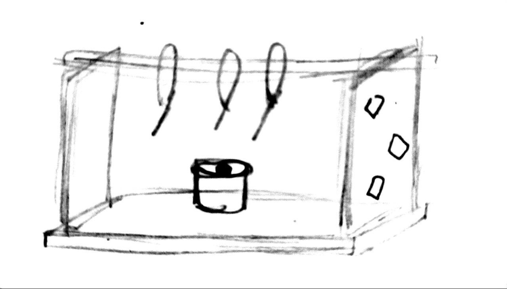
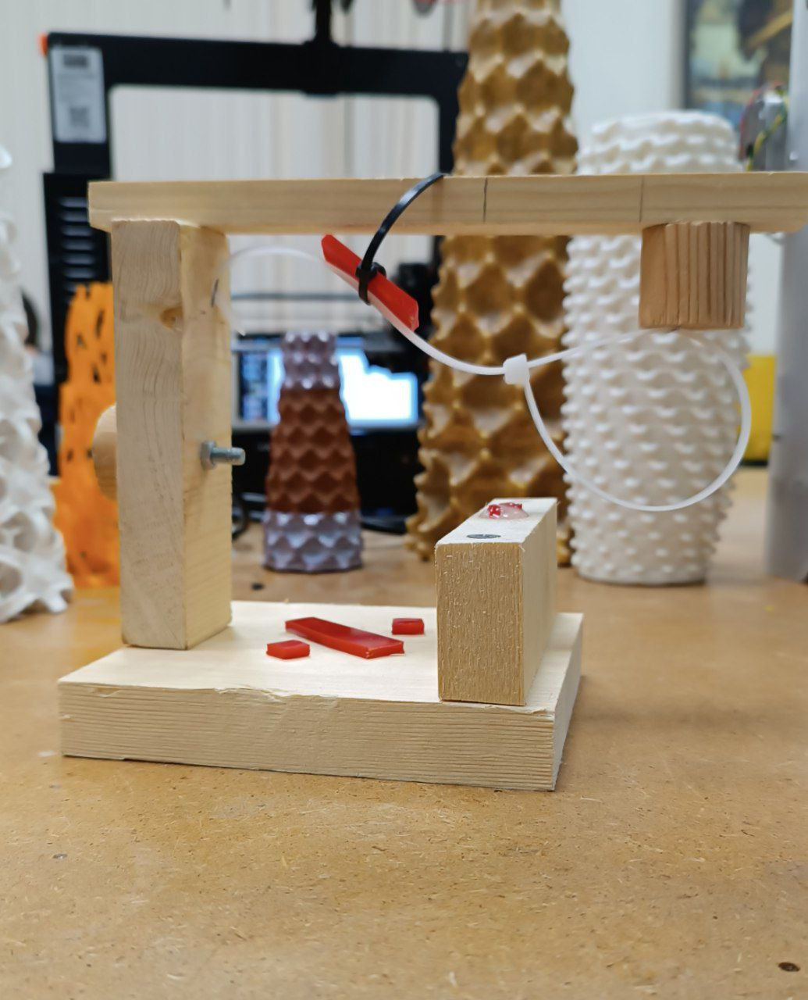

# totem
## Создание абстрактного образа с помощью различных инструментов и материалов

### Материалы и оборудование

- брус
- акрил

Использовано:

- [x] защитные очки и наушники;
- [x] сверлильный станок;
- [x] ножовка или дремель или мини-болгарка;
- [x] лобзик или реноватор;
- [x] саморезы;
- [x] болты и гайки (но не слишком много);
- [x] надфили (напильники);
- [x] ножницы по металлу;
- [x] шуруповерт;
- [x] шестигранные ключи;
- [x] стяжки (тоже не слишком много);
- [x] клей ПВА, клей цианакрилатный, горячий клей;
- [x] степлер;
- [x] эпоксидная смола и УФ;
- [x] какой-то измерительный инструмент (линейка, рулетка, штангенциркуль);
- [ ] 3D-ручка (опционально).

### Разработка и производство

*Вдохновения не было. Разработка была на уровне эскиза. В процессе работы тотем видоизменялся по мере необходимости использования большего количества инструментов и возникновения новых идей.*

Рис.1 - Скетчинг

[Видео. Производство тотема](https://drive.google.com/file/d/1OR81s60e9v0lPw6OBSEBdLDB7j_MFpVi/view?usp=drivesdk) 

### Результат

Рис.2 - Готовый тотем 
